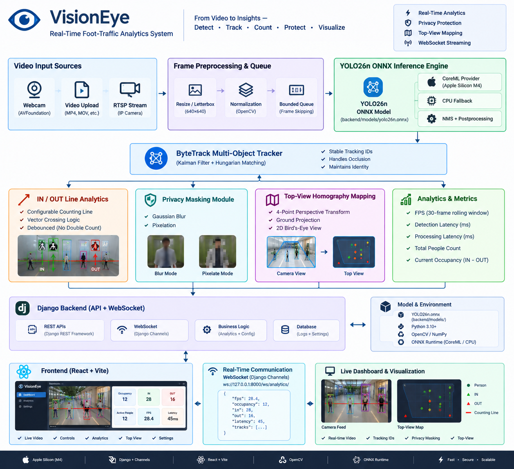

# VisionEye — Real-Time Foot-Traffic Analytics & Computer Vision Platform

> **Production-Grade Computer Vision & Foot-Traffic Analytics Platform**  
> Powered by **YOLO26n ONNX**, **ByteTrack Multi-Object Tracking**, **4-Point Ground Homography**, **Django Channels WebSockets**, **React 18 + Vite**, **Universal Docker Container**, and **Multi-OS Desktop Packaging**.
> 
> Official Web & Download Portal: **[https://pvsairamsaketh.in](https://pvsairamsaketh.in)**  
> Cloud Deployment: **Microsoft Azure** (Cloud Production Instance)

---

## 1. Overview & Key Capabilities

VisionEye is an end-to-end, privacy-compliant, edge-accelerated computer vision platform engineered for retail analytics, occupancy tracking, and spatial foot-traffic monitoring.

- **Universal Accessibility**: Run as a native Desktop App (macOS, Windows, Linux) OR access the live web application on any device (Android, iOS, iPadOS, Smart TVs, Browsers) via universal Docker container.
- **Real-Time Person Detection**: Ultra-fast YOLO26n ONNX inference (~9–12ms latency on Apple Silicon CoreML and multi-threaded CPU fallback).
- **Multi-Person Tracking (ByteTrack)**: Robust Kalman Filter and Hungarian IoU association maintaining stable tracking IDs across frames.
- **IN / OUT Virtual Counting Line**: Configurable 2D counting threshold with debounced vector-crossing logic to eliminate double counting.
- **Live Occupancy Monitoring**: Computes net real-time occupancy ($\text{IN} - \text{OUT} \ge 0$).
- **Privacy Protection Masking**: Automatic real-time Gaussian Blur or Pixelation over detected persons before streaming.
- **Top-View 2D Scene Mapping**: 4-point homography perspective transformation projecting person bottom-center ground coordinates onto a 2D bird's-eye minimap.
- **WebSocket Real-Time Telemetry**: Sub-millisecond JSON state synchronization via Django Channels (`ws://127.0.0.1:8000/ws/analytics/`).
- **Live Video Feed**: High-efficiency MJPEG stream (`/api/video/feed`) with interactive drag-and-drop calibration overlay.
- **Automated CI/CD & Cloud Deployment**: 
  - **CI Gatekeeper**: Automated testing and build verification on every commit/PR. If CI fails, production deployment is strictly blocked.
  - **CD Cloud Pipeline**: Builds and pushes multi-platform Docker container to Docker Hub, then automatically deploys to Azure VM with Nginx reverse proxy and SSL.
  - **Release Pipeline**: Packages native desktop installers (`.dmg`, `.exe`, `.AppImage`) on Git tag push (`v1.0.0`), generates SHA-256 checksums, publishes GitHub Releases, and deploys `website/` to `pvsairamsaketh.in`.

---

## 2. System Architecture & Pipeline Flow

<p align="center">
  
</p>

### End-to-End Architectural Tiers:
1. **Tier 1: Ingestion & Input Streams**: 30–60 FPS video ingestion from USB/FaceTime HD webcams, industrial RTSP surveillance streams, and looping local MP4/MOV video files with seamless auto-recovery.
2. **Tier 2: Edge CV & Neural Pipeline**: 640×640 letterbox resizing ➔ YOLO26n ONNX neural inference (9–12ms with Apple Silicon CoreML / multi-threaded CPU fallback) ➔ ByteTrack Kalman Filter tracking ➔ Configurable IN/OUT counting line ➔ 4-Point ground homography perspective projection & Privacy blur.
3. **Tier 3: Asynchronous Backend**: Django 5 Channels + Daphne ASGI server broadcasting sub-millisecond telemetry over WebSockets (`/ws/analytics/`), streaming high-speed MJPEG video (`/api/video/feed`), and exposing REST APIs.
4. **Tier 4: Universal Client Layer**: Native desktop packages for macOS (Apple Silicon & Intel), Windows x64, and Linux x64 alongside a responsive React 18 / Vite Cyber-HUD web application.
5. **Tier 5: CI/CD & Cloud Infrastructure**: Automated GitHub Actions CI quality gate (13/13 Pytest test suite), multi-platform Docker container registry, and cloud production VM deployment behind Nginx TLS reverse proxy.

---

## 3. CI/CD & Deployment Pipeline

```text
                                Developer
                                    │
                         git push / git tag (vX.Y.Z)
                                    │
                                    ▼
                         GitHub Repository
                                    │
                 ┌──────────────────┴──────────────────┐
                 ▼                                     ▼
        Pull Request / Push to main            Git Tag Push (v*.*.*)
                 │                                     │
                 ▼                                     ▼
        [.github/workflows/ci.yml]          [.github/workflows/release.yml]
        • Backend Pytest (13/13 tests)      • Multi-OS Build Matrix:
        • Frontend Vite Build Check           - macOS ARM64 (.dmg)
        • Universal Docker Build Dry-Run      - macOS Intel (.dmg)
        • Desktop Packaging Dry-Run           - Windows x64 (.exe)
                 │                            - Linux x64 (.AppImage & .deb)
        [ MUST PASS 100% ]                  • Generate SHA256SUMS.txt
                 │                          • Create GitHub Release
                 ▼                          • Deploy Portal to pvsairamsaketh.in
     [.github/workflows/deploy-azure.yml]
        • Build & Push to Docker Hub
          (pvsairamsaketh/visioneye:latest)
        • SSH to Azure Cloud VM
        • Rolling Container Restart & SSL
        • Live Healthcheck Verification
```

---

## 4. Technology Stack

| Layer | Technologies | Description |
| :--- | :--- | :--- |
| **Desktop Wrapper** | Electron 30, Electron Builder | Cross-platform desktop application packaging |
| **Container Engine**| Docker Multi-Stage, Docker Compose | Universal cross-platform container (Node 20 + Python 3.11 slim) |
| **Cloud Hosting**   | Microsoft Azure VM (Ubuntu Linux) | Cloud hosting configured for high availability |
| **Reverse Proxy**   | Nginx 1.25, Let's Encrypt Certbot | SSL/TLS termination, HTTP/2, WebSockets, and MJPEG streaming |
| **Frontend UI**     | React 18, Vite 5, Lucide Icons | Futuristic cyber-HUD dark theme with Vanilla CSS & Canvas |
| **Backend API**     | Django 5, Channels 4, Daphne ASGI | Asynchronous ASGI server for REST & low-latency WebSockets |
| **Computer Vision** | ONNX Runtime, OpenCV, NumPy, SciPy | YOLO26n ONNX inference with CoreML/CPU providers, ByteTrack, Homography |
| **Download Portal** | Semantic HTML5, CSS3, JavaScript | Hosted on GitHub Pages with custom domain `pvsairamsaketh.in` |
| **CI/CD Automation**| GitHub Actions | Automated quality gatekeeper, release matrix, and cloud CD |

---

## 5. Local Development Quickstart

### Prerequisites
- Python 3.11+
- Node.js 18+ and npm
- (Optional) Docker & Docker Compose

### 1-Command Local Startup (Native)
```bash
chmod +x dev.sh
./dev.sh
```
- **Frontend Dashboard**: `http://127.0.0.1:5173`
- **Backend REST & WS**: `http://127.0.0.1:8000`
- **Video Feed**: `http://127.0.0.1:8000/api/video/feed`
- **WebSocket Feed**: `ws://127.0.0.1:8000/ws/analytics/`

### 1-Command Local Startup (Docker)
```bash
docker compose up --build
```
Access `http://127.0.0.1:8000` in any browser.

---

## 6. Running the Test Suite

```bash
PYTHONPATH=backend ./backend/venv/bin/pytest backend/tests/ -v
```
All 13 unit and integration tests run in under 15 seconds, testing:
- Django Health & Camera Diagnostics API
- Runtime Config & Counting Line API
- Foot-Traffic Analytics Crossing Vectors & Debouncing
- YOLO26n ONNX Detector Letterboxing & Inference
- 4-Point Perspective Homography Mapping
- ByteTrack Multi-Person Kalman Filtering & Tracking

---

## 7. Deployment Guides

- **[Docker & Azure Integration Architecture](docs/DOCKER_AZURE_INTEGRATION.md)**: Complete guide explaining how Docker, Azure VM, Docker Hub, Nginx SSL, and GitHub Actions CI/CD connect together.
- **[Azure Cloud Deployment Guide](docs/AZURE_DEPLOYMENT.md)**: Full instructions for provisioning Azure VM, setting up Docker Hub, configuring Nginx reverse proxy, and enabling GitHub Actions CD.
- **[GoDaddy DNS Configuration](docs/DOMAIN_SETUP.md)**: Exact A-records and CNAME setup to point `pvsairamsaketh.in` and `www.pvsairamsaketh.in` to the website or Azure instance.
- **[Release Playbook](docs/RELEASE.md)**: How to create a release tag (`git tag v1.0.0`), monitor GitHub Actions, and verify SHA-256 checksums.
- **[Installation Guide](docs/INSTALLATION.md)**: End-user setup instructions for macOS, Windows, Linux, and Mobile Web.

---

## 8. License & Credits

Copyright © 2026 **P V Sairam Saketh**.  
Licensed under the [MIT License](LICENSE).
